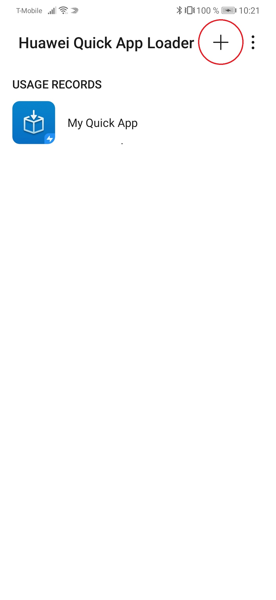
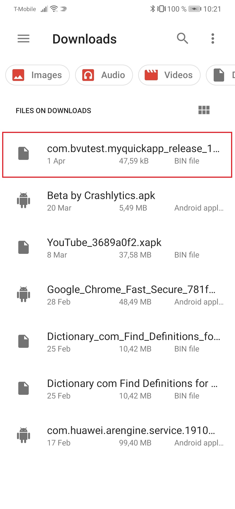

# ESPNcricinfo-public

## How to use

### Install Quick App Loader

Make sure to install the Huawei Quick App Loader on the test device.
https://developer.huawei.com/consumer/en/doc/development/quickApp-Guides/quickapp-installtool#h1-1578318207348

### Run a standalone RPK file

Connect the test device via USB and ensure that the USB settings have been set to file transfer. Copy the RPK file over to the Downloads folder, launch the Huawei Quick App Loader, and tap the "+" button at the top right.

<kbd>
  
</kbd>

Navigate to the Downloads folder and select the RPK file. The Quick App has been added and is now accessible from the main menu of the Quick App Loader.

<kbd>
  
</kbd>
